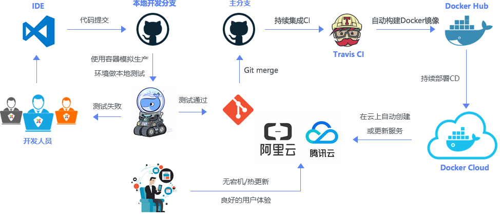

# Start

## Get Docker

### Ubuntu

```shell
# sudo 普通用户希望用root权限执行
# wget 下载命令
# -qO(字母) 限制输出跟普通输出
# | sh 用SH的方式执行
sudo wget -qO- https://get.docker.com | sh

# 这个命令的意思是把当前用户加入docker用户组。
sudo usermod -aG docker 用户名

# 安装 docker-compose
curl https://github.com/docker/compose
```

### CentOS

```shell
# CentOS7 系统 CentOS-Extras 库中已带 Docker，可以直接安装：
$ sudo yum install docker

# 安装之后启动 Docker 服务，并让它随系统启动自动加载。
$ sudo service docker start
$ sudo chkconfig docker on
```

## Overview



**Docker image**: It is an executable file which contains cutdown operating system and all the libraries and configuration needed to run the application. It has multiple layers stacked on top of each other and represented as single object. A docker image is created using docker file, we will get to that in a bit.

**Docker Container**: It is a running instance of docker image. there can be many containers running from same docker image.

### Dockerfile

Environment variables are supported by the following list of instructions in the [Dockerfile](https://docs.docker.com/engine/reference/builder/):

- ADD
- COPY
- ENV
- EXPOSE
- FROM
- LABEL
- STOPSIGNAL
- USER
- VOLUME
- WORKDIR

For example

```Dockerfile
# pulls node.js docker image from docker hub
FROM node:8

# The ARG instruction defines a variable
# that users can pass at build-time to the builder with the
# `docker build` command using the --build-arg <varname>=<value> flag.
# docker build --build-arg ENV_TAG=prod .
ARG ENV_TAG
ENV ENV_TAG ${ENV_TAG}
WORKDIR /app
COPY package.json /app
RUN npm install
COPY . /app
EXPOSE 8081
CMD node index.js
```

### Image

### Container
